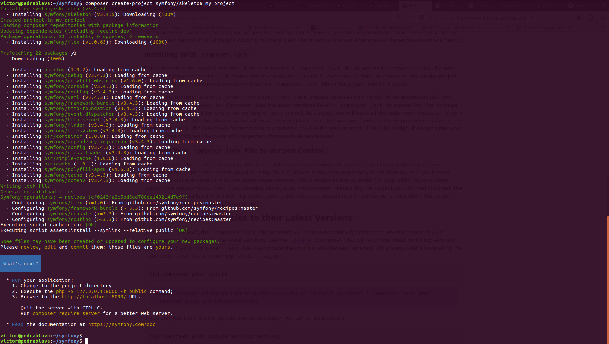
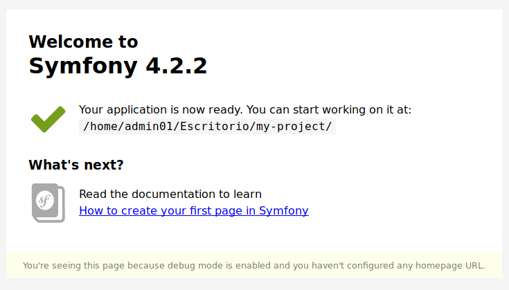
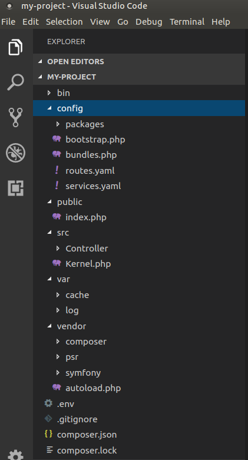
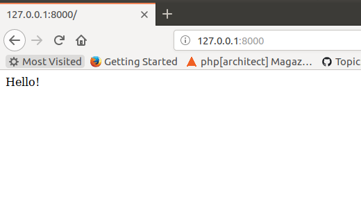
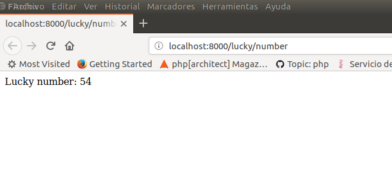

# Instalación de Symfony y primeros pasos

[Symfony](http://symfony.com/) es un framework PHP para desarrollo de aplicaciones web así como un conjunto de componentes PHP para usar en tus proyectos.

Hasta ahora, hemos desarrollado todo nuestro código partiendo sólo de las herramientas que provee la librería PHP estándar: sesiones, headers, http request y response, bases de datos, redirecciones, urls limpias, etc. Hemos  creado, además, nuestro propio patrón MVC para separar la lógica de negocio, de la vista \(presentación\) y del controlador y finalmente hemos usado el microframework **Slim**.

`Symfony`, y cualquier otro framework `PHP`,  nos ayuda a trabajar con todas estas cuestiones de una manera más sencilla y profesional, permitiendo definir nuestra aplicación a través de controladores.

Para comprobar esta diferencias, visitad la página [Symfony versus flat PHP](http://symfony.com/doc/2.4/book/from_flat_php_to_symfony2.html)


## Instalar Symfony

Es tan sencillo como ejecutar el siguiente comando

```bash
$ composer create-project symfony/skeleton my_project
```



Este comando crea un nuevo proyecto `symfony` en la carpeta `my_project`

Para poder servirlo como una aplicación web, usamos el propio servidor web incorporado en PHP.

```bash
$ cd my_project
$ php -S 127.0.0.1:8000 -t public
```

Este último comando hace que el Document Root del servidor incorporado en `PHP` sea el directorio `public`, que es donde reside `index.php` y aquí empieza todo!

> El directorio `public` es el hogar de todos los archivos públicos y estáticos de la aplicación, incluidas imágenes, hojas de estilo y archivos JavaScript. También es donde vive el controlador frontal \(`index.php`\).

En la siguiente página explica cómo [configurar apache](https://symfony.com/doc/current/setup/web_server_configuration.html) para que pueda servir aplicaciones en `Symfony`.

[http://127.0.0.1:8000/](http://127.0.0.1:8000/)



Si abres el proyecto con **Visual Studio Code**, verás la siguiente estructura  



Como ves, automáticamente crea un repositorio git.

> NOTA:
>
> `composer create-project` permite crear nuevos proyectos a partir de un paquete existente. Es el equivalente a `git clone` y `composer install`

La estructura del proyecto te debe sonar porque es muy parecida a la que hemos creado en el resto de prácticas.

## Primeros pasos

Antes que nada, vamos a analizar el archivo `index.php`

```php
//Crea el núcleo de Symfony
$kernel = new Kernel($env, $debug);
//Recoge la petición al servidor
$request = Request::createFromGlobals();
//El kernel realiza el tratamiento de la petición enrutándola
$response = $kernel->handle($request);
//Devuelve la petición al cliente
$response->send();
//Termina el kernel
$kernel->terminate($request, $response);
```

El archivo `index.php` es bien sencillo:   
1. Recoge la petición  
2. Es procesada por el kernel  
3. La devuelve al cliente.

Es el equivalente al controlador frontal de Slim:

```php
<?php
use \Psr\Http\Message\ServerRequestInterface as Request;
use \Psr\Http\Message\ResponseInterface as Response;

require 'vendor/autoload.php';

$app = new \Slim\App;
$app->get('/hello/{name}', function (Request $request, Response $response, array $args) {
    $name = $args['name'];
    $response->getBody()->write("Hello, $name");

    return $response;
});
$app->run();
```


### Vamos a ver algunos ejemplos básicos.

La página por defecto `home` \(/\) de `Symfony` es "_Welcome to Symfony_", porque todavía no hemos configurado ninguna ruta para que nos devuelva otro contenido. El proceso de crear una nueva ruta, consta de dos partes: definir la ruta y escribir el controlador asociado a la misma:

En Slim, las rutas se definían en el controlador frontal:

```php
$app->get('/', PageController::class . ':home')->setName("home");
```

Y en Symfony se definen en el archivo `config/routes.yaml`

```yaml
#index:
#    path: /
#    defaults: { _controller: 'App\Controller\DefaultController::index' }
```

Descomentadlo:

```yaml
index:
    path: /
    defaults: { _controller: 'App\Controller\DefaultController::index' }
```

Esto define una `ruta` llamada `index` para el `path` **/** y el controlador que va a tratar la petición en ese path, en este caso el método `index` de la clase `DefaultController`

Ahora cread un archivo `DefaultController.php` en `src/Controller/`

`>> DefaultController.php`

```php
<?php
namespace App\Controller;

use Symfony\Component\HttpFoundation\Response;

class DefaultController
{
    public function index()
    {
        return new Response('Hello!');
    }
}
?>
```

Si todo va bien, ya tenéis creada la página de inicio de vuestra web.



Vamos a crear una segunda página que muestre un número aleatorio en la ruta `/lucky/number`. Primero definimos la nueva ruta en `config/routes.yaml`

```yaml
lucky_number:
    path: /lucky/number
    defaults: { _controller: 'App\Controller\LuckyController::numberAction' }
```

Y creamos el script php en `src/Controller/` con el nombre `LuckyController.php`

`>> LuckyController.php`

```php
<?php
namespace App\Controller;

use Symfony\Component\HttpFoundation\Response;

class LuckyController
{
    public function numberAction()
    {
        $number = mt_rand(0, 100);

        return new Response(
            '<html><body>Lucky number: '.$number.'</body></html>'
        );
    }
}
?>
```

Si todo va bien, mostrará la siguiente página al visitar la url [http://localhost:8000/lucky/number](http://localhost:8000/lucky/number)



Ahora vamos a crear dos rutas: una para mostrar un resumen de todas las entradas de blog y otra para mostrar una entrada de blog concreta.

`>> routes.yaml`

```yaml
blog_list:
    path:     /blog
    controller: App\Controller\BlogController::list

blog_show:
    path:     /blog/{entryId}
    controller: App\Controller\BlogController::show
```

Según estas definiciones de ruta, hemos de crear la clase `BlogController` con los métodos `list` y `show`. La ruta `blog_show` tiene un parámetro llamado `entryid`. Este parámetro será pasado por el kernel al método `show`.

`>> BlogController.php`

```php
<?php
namespace App\Controller;

use Symfony\Component\HttpFoundation\Response;

class BlogController
{
    public function list()
    {
      $content = "<ul>";
      for($i = 1; $i <= 10; $i++){
        $content .= "<li>Entrada $i </li>";
      }
      $content .= "</ul>";
        return new Response(
            "<html><body>$content</body></html>"
        );
    }
    public function show($entryId)
    {

        return new Response(
            '<html><body>Entrada ' . $entryId . '</body></html>'
        );
    }
}
?>
```

## Separar la presentación de la lógica

Vamos a usar el motor de plantillas `twig` usado por `Symfony`. Primero hemos de instalarlo con `composer`

```bash
composer require symfony/twig-bundle
```

Ahora creamos dos nuevas rutas:

```yaml
blog_list_twig:
    path:     /blogtwig
    defaults: { _controller: 'App\Controller\BlogControllerTwig::list' }

blog_show_twig:
    path:     /blogtwig/{entryId}
    defaults: { _controller: 'App\Controller\BlogControllerTwig::show' }
```

Creamos las plantillas `twig`

`>> templates/blog/entry.html.twig`

```html
<html><body>Entrada: {{entryId}}</body></html>
```

`>> templates/blog/list.html.twig`

```html
<html><body>
<ul>
  
      <li>Entrada {{ i }}</li>,
  
</ul>
</body></html>
```

Y modificamos un poco el controlador para que use estas plantillas:

```php
<?php
namespace App\Controller;

use Symfony\Component\HttpFoundation\Response;
use Symfony\Bundle\FrameworkBundle\Controller\AbstractController;

class BlogControllerTwig extends AbstractController
{
    public function list()
    {
      return $this->render('blog/list.html.twig');
    }
    public function show($entryId)
    {
      return $this->render('blog/entry.html.twig', array('entryId' => $entryId));
    }

}
?>
```

---

**Más información en**

[https://symfony.com/at-a-glance](https://symfony.com/at-a-glance)  
[http://symfony.com/doc/current/quick\_tour/the\_big\_picture.html](http://symfony.com/doc/current/quick_tour/the_big_picture.html)  
[https://symfony.com/doc/current/page\_creation.html](https://symfony.com/doc/current/page_creation.html)  
[https://symfony.com/doc/current/controller.html](https://symfony.com/doc/current/controller.html)

