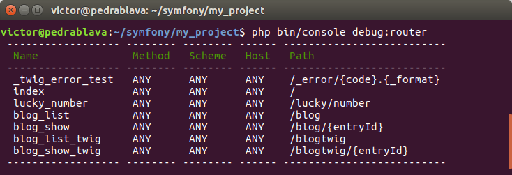

# 2 Routing

A partir de ahora, vamos a usar anotaciones para definir las rutas. De esta forma es más sencillo ya que las tenemos definidas en el propio código `php`

Para ello, ve a la carpeta del proyecto y escribe este comando

```bash
composer require annotations
```

En cualquier momento, podemos conocer qué rutas están definidas mediante el siguiente comando:

```bash
php bin/console debug:router
```

La salida será parecida a esta:


A partir de ahora ya no usaremos el archivo `config/routes.yaml`, sino que las definimos en el propio controlador.

Vamos a ver un ejemplo de una ruta definida con anotaciones.

Primero eliminad las rutas `blog_list` y `blog_show` de `config/routes.yaml` porque las definiremos con una anotación.

`>> src/Controller/BlogControllerAnnotation.php`

```php
namespace App\Controller;

use Symfony\Bundle\FrameworkBundle\Controller\Controller;
use Symfony\Component\Routing\Annotation\Route;

class BlogControllerAnnotation extends Controller{
    /**
    * @Route("/blogAnnotation", name="blog_list")
    */
    public function list()
    {
        // ...
    }

    /**
    * @Route("/blogAnnotation/{entryName}", name="blog_show")
    */
    public function show($entryName)
    {
        // $entryName will equal the dynamic part of the URL
        // e.g. at /blog/yay-routing, then $entryName='yay-routing'

        // ...
    }
}
```

## Uso de requisitos en {comodines}

Imagina que la ruta de `blog_list` contiene una lista paginada de publicaciones de blog, con URL como `/blog/2` y `/blog/3` para las páginas 2 y 3. Si cambiamos la ruta a `/blog/{page}`, tendremos un problema:

```
blog_list: /blog/{page} coincidirá con /blog/*;
blog_show: /blog/{entryName} también coincidirá con /blog/ *.
```

Cuando dos rutas coinciden con la misma URL, la primera ruta que se carga gana. Desafortunadamente, eso significa que `/blog/yay-routing` coincidirá con la ruta `blog_list`. ¡No es bueno!

Para solucionar esto, agrega un requisito para que el comodín {page} solo pueda coincidir con números \(dígitos\):

```php
<?php
// ...
class BlogControllers extends Controller{
    /**
    * @Route("/blog/{page}", name="blog_list", requirements={"page"="\d+"})
    */
    public function list($page){
        // ...
    }

    /**
    * @Route("/blog/{entryName}", name="blog_show")
    */
    public function show($entryName){
        // ...
    }
}
?>
```

El `\d+` es una expresión regular que coincide con un dígito de cualquier longitud. Ahora:

| URL | Ruta | Parámetros |
| :--- | :--- | :--- |
| /blog/2 | blog\_list | $page = 2 |
| /blog/nombre-de-entrada | blog\_show | $entryName = nombre-de-entrada |


## Valores por defecto en {comodines}

En el ejemplo anterior, `blog_list` tiene una ruta a `/blog/{page}`. Si el usuario visita `/blog/1`, coincidirá. Pero si visita `/blog`, no coincidirá. Tan pronto como agregamos un `{comodín}` a una ruta, debe tener un valor.

Entonces, ¿cómo puedes hacer que `blog_list` coincida cuando el usuario visita `/blog`? La respuesta es, **agregando un valor predeterminado**:
Se puede hacer de dos formas:
**1** Mediante anotaciones

```php
class BlogControllers extends Controller{
    /**
    * @Route("/blog/{page}", name="blog_list", requirements={"page"="\d+"}, defaults={"page"=1})
    */
    public function list($page)
    {
        // ...
    }
}
```
**2** Mediante parámetros `php` por defecto
```php
class BlogControllers extends Controller{
    /**
    * @Route("/blog/{page}", name="blog_list", requirements={"page"="\d+"})
    */
    public function list($page = 1)
    {
        // ...
    }
}
```

Ahora, cuando el usuario visita `/blog`, la ruta de `blog_list` coincidirá y **$page** tendrá un valor predeterminado de **1**.

## Ignorar parámetros en la ruta
No hace falta que todos los parámetros recogidos en la ruta, sean tratados en el controlador. Por ejemplo, en el siguiente controlador no nos interesa procesar el  parámetro `{entryName}`
```php
    /**
    * @Route("/blog/{entryName}/{entryId}", name="blog_show_by_id")
    */
    public function showById($entryId)
    {

        return new Response(
            '<html><body>Entrada ' . $entryId . '</body></html>'
        );
    }
```
Esto viene muy bien cuando estamos creando url para los buscadores.

## Añadir requerimientos en el método HTTP
Además de la `URL`, también puedes hacer coincidir el método de la solicitud entrante (es decir, `GET`, `HEAD`, `POST`, `PUT`, `DELETE`). Supongamos que creas una API para tu tienda y tiene 2 rutas: una para mostrar un producto (en una solicitud `GET` o `HEAD`) y otra para actualizar un producto (en una solicitud `PUT` o `POST`). Esto se puede lograr con la siguiente configuración de ruta:
```php
class ProductApiController extends Controller{
    /**
    * @Route("/api/productos/{id}", methods={"GET","HEAD"})
    */
    public function show($id)
    {
        // ... devolver una respuesta json con el producto
    }
    
    /**
    * @Route("/api/productos/{id}", methods={"PUT", "POST"})
    */
    public function edit($id)
    {
        // ... editar un producto
    }
}
```

A pesar de que estas dos rutas son idénticas (`/api/productos/{id}`), la primera ruta solo hará coincidir las solicitudes `GET` o `HEAD` y la segunda ruta solo hará coincidir las solicitudes `PUT` o `POST`. Esto significa que puedes visualizar y editar el producto con la misma URL, mientras uses controladores distintos para las dos acciones.

También se puede usar otro tipo de requerimientos, como por ejemplo:
* **User Agent**. Por ejemplo, para que coincida con Firefox
```yaml
# config/routes.yaml
contact:
    path:       /contact
    controller: 'App\Controller\DefaultController::contact'
    condition:  "context.getMethod() in ['GET', 'HEAD'] and request.headers.get('User-Agent') matches '/firefox/i'"
```
* **HOST**. Por ejemplo, para servir una página distinta dependiendo del host

```php
// src/Controller/MainController.php
namespace App\Controller;

use Symfony\Bundle\FrameworkBundle\Controller\Controller;
use Symfony\Component\Routing\Annotation\Route;

class MainController extends Controller
{
    /**
     * @Route("/", name="mobile_homepage", host="m.example.com")
     */
    public function mobileHomepage()
    {
        // ...
    }

    /**
     * @Route("/", name="homepage")
     */
    public function homepage()
    {
        // ...
    }
}
```

## Generar url's

El sistema de rutas es bidireccional: mapea una ruta a un controlador y también una ruta a una url. Es similar al método de Slim:

```php
//En Slim
$this->container->router->pathFor('cart-add', ['id' => $producto->getId()])
```

Y en Symfony:

```php
 $url = $this->generateUrl('blog_show', ['entryId' => $entryId]);
```

Por ejemplo:

```php
use Symfony\Component\Routing\Generator\UrlGeneratorInterface;
    // ...
class BlogController  extends Controller
{
    // ...
    /**
    * @Route("/blog/{entryId}", name="blog_show")
    */
    public function show($entryId)
    {
      $url = $this->generateUrl(
      'blog_show',
      ['entryId' => $entryId]
      );
        return new Response(
            '<html><body>Entrada ' . $entryId . ' url ' . $url . '</body></html>'
        );
    }
```

## Generar url's con `query strings`
El método `generateUrl()` toma una matriz de valores {comodín} para generar el URI. Pero si pasas más, se agregarán al URI como una cadena de consulta:
```php
$url = $this->generateUrl('blog_list', [
    'page' => 2,
    'category' => 'Symfony',
]);
// 
```

Dará como resultado:

```
/blog/2?category=Symfony
```

Fijáos en `?` en el querystring!

## Generar urls's absolutas

De forma predeterminada, el enrutador generará URL relativas (por ejemplo, `/blog`). Si pasamos el parámetro `UrlGeneratorInterface::ABSOLUTE_URL` al tercer argumento del método `generateUrl()` generará una url absoluta:
```php
use Symfony\Component\Routing\Generator\UrlGeneratorInterface;
// ...
class BlogController extends Controller
{
    // ...
    $url = $this->generateUrl('blog_list', array(
          'page' => 2,
          'category' => 'Symfony',
        ), UrlGeneratorInterface::ABSOLUTE_URL);
     
}
```
Generará

```
http://127.0.0.1:8000/blog/2?category=Symfony  
```

## Mostrar una página estática no asociada a un controlador

Por lo general, cuando necesitamos crear una página, necesitamos crear un controlador y representar una plantilla desde ese controlador. Pero si estamos renderizando una plantilla simple que no necesita datos, podemos evitar crear el controlador por completo, utilizando el controlador integrado `Symfony\Bundle\FrameworkBundle\Controller\TemplateController::templateAction`

Por ejemplo, supongamos que deseamos representar una plantilla `static/privacy.html.twig`, que no requiere que se le pasen variables. Podemos hacer esto sin crear un controlador, editando, esta vez sí, el archivo `config/routes.yaml`:
```yaml
# config/routes.yaml
acme_privacy:
    path:         /privacy
    controller:   Symfony\Bundle\FrameworkBundle\Controller\TemplateController::templateAction
    defaults:
        template: static/privacy.html.twig
```
La plantilla hemos de guardarla en el directorio `/templates/static/`
