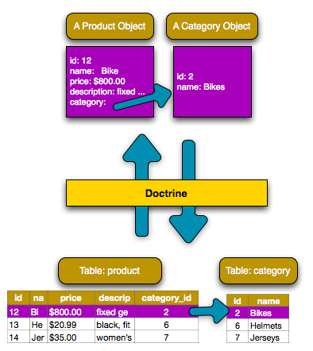
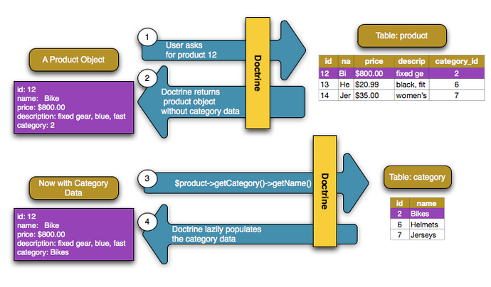

# Doctrine Associations

Hay **dos** tipos principales de relación/asociación:

`ManyToOne` / `OneToMany`

La relación más común, asignada en la base de datos con una columna de clave ajena simple (por ejemplo, una columna `category_id` en la tabla `product`). En realidad, este es solo un tipo de asociación, pero se ve desde los dos lados diferentes de la relación.

`ManyToMany`

Usa una tabla de unión y es necesaria cuando ambos lados de la relación tienen muchos del otro lado (por ejemplo, "estudiantes" y "clases": cada alumno está en muchas clases, y cada clase tiene muchos alumnos).

Primero, debes determinar qué relación usar. Si ambos lados de la relación contendrán muchos del otro lado (por ejemplo, "estudiantes" y "clases"), se necesita una relación `ManyToMany`. De lo contrario, es probable que necesite un `ManyToOne`.

> **tip**
>
> También hay una relación `OneToOne` (por ejemplo, un usuario tiene un perfil y viceversa). En la práctica, usar esto es similar a `ManyToOne`.

La Asociación ManyToOne / OneToMany
-------------------------------------

Supongamos que cada producto en tu aplicación pertenece exactamente a una categoría. En este caso, necesitarás una clase **Category** y una forma de relacionar un objeto **Product** con un objeto **Category**.

Comenzamos por crear una entidad de **Category**:

```bash
$ php bin/console make:entity Category
```

Luego añadimos  el campo `name` a la clase **Category** 

```php
// src/Entity/Category.php
// ...

class Category
{
    /**
     * @ORM\Id
     * @ORM\GeneratedValue
     * @ORM\Column(type="integer")
     */
    private $id;

    /**
     * @ORM\Column(type="string")
     */
    private $name;

    // ... getters and setters
}
```

Mapeo de la relación ManyToOne
----------------------------------

En este ejemplo, cada categoría se puede asociar con muchos productos. Pero, cada producto puede asociarse con una sola categoría. Esta relación se puede resumir como: muchos productos en una categoría (o, de manera equivalente, una categoría en muchos productos).

Desde la perspectiva de la entidad **Producto**, esta es una relación muchos a uno. Desde la perspectiva de la entidad **Category**, esta es una relación de uno a muchos.

Para mapear esto, primero creamos una propiedad `category` en la clase **Product** con la anotación `ManyToOne`:

```php
// src/Entity/Product.php

// ...
class Product
{
    // ...

    /**
     * @ORM\ManyToOne(targetEntity="App\Entity\Category", inversedBy="products")
     * @ORM\JoinColumn(nullable=true)
     */
    private $category;

    public function getCategory(): Category
    {
        return $this->category;
    }

    public function setCategory(Category $category)
    {
        $this->category = $category;
    }
}
```
En `yaml`

```yaml
# src/Resources/config/doctrine/Product.orm.yml
App\Entity\Product:
    type: entity
    # ...
    manyToOne:
        category:
            targetEntity: App\Entity\Category
            inversedBy: products
            joinColumn:
                nullable: true
```

Este mapeo de varios a uno es obligatorio. Le dice a `Doctrine` que use la columna `category_id` en la tabla `Product` para relacionar cada registro en esa tabla con un registro en la tabla `Category`.

A continuación, dado que un objeto **Category** se relacionará con muchos objetos **Product**, agrega una propiedad `products` a **Category** que contendrá esos objetos:

```php
// src/Entity/Category.php

// ...
use Doctrine\Common\Collections\ArrayCollection;
use Doctrine\Common\Collections\Collection;

class Category
{
    // ...

    /**
     * @ORM\OneToMany(targetEntity="App\Entity\Product", mappedBy="category")
     */
    private $products;

    public function __construct()
    {
        $this->products = new ArrayCollection();
    }

    /**
     * @return Collection|Product[]
     */
    public function getProducts()
    {
        return $this->products;
    }
}
```
En `yaml`
```yaml
# src/Resources/config/doctrine/Category.orm.yml
App\Entity\Category:
    type: entity
    # ...
    oneToMany:
        products:
            targetEntity: App\Entity\Product
            mappedBy: category
# Don't forget to initialize the collection in
# the __construct() method of the entity
```
Se requiere el mapeo de `ManyToOne` que se muestra anteriormente, pero este `OneToMany` es opcional: solo agrégalo si deseas poder acceder a los productos que están relacionados con una categoría. En este ejemplo, será útil poder llamar `$category->getProducts()`. Si no los quieres, tampoco necesitas las configuraciones `invertedBy` o `mappedBy`.

> **¿Para qué es este ArrayCollection?**
>
> El código dentro de `__construct()` es importante: la propiedad `$products` debe ser un objeto de colección que implemente la interfaz de `Collection` de `Doctrine`. En este caso, se utiliza un objeto `ArrayCollection`. 
>

¡La base de datos está configurada! Ahora, ejecuta las migraciones como siempre:

```bash
$ php bin/console doctrine:migrations:diff
$ php bin/console doctrine:migrations:migrate
```

Gracias a la relación, esto crea una columna de clave ajena `category_id` en la tabla `products`. ¡`Doctrine` está listo para persistir en nuestra relación!

Guardando Entidades Relacionadas
-----------------------

¡Ahora puedes ver este nuevo código en acción! Imagina que estás dentro de un controlador:

```php
// ...

use App\Entity\Category;
use App\Entity\Product;
use Symfony\Component\HttpFoundation\Response;

class ProductController extends Controller
{
    /**
     * @Route("/product", name="product")
     */
    public function index()
    {
        $category = new Category();
        $category->setName('Computer Peripherals');

        $product = new Product();
        $product->setName('Keyboard');
        $product->setPrice(19.99);
        $product->setDescription('Ergonomic and stylish!');

        // relate this product to the category
        $product->setCategory($category);

        $em = $this->getDoctrine()->getManager();
        $em->persist($category);
        $em->persist($product);
        $em->flush();

        return new Response(
            'Saved new product with id: '.$product->getId()
            .' and new category with id: '.$category->getId()
        );
    }
}
```

Cuando vayas a `/product`, se agrega una nueva filas tablas `category` y `product`. La columna `product.category_id` para el nuevo producto se configura con el `id` de la nueva categoría. `Doctrine` maneja la persistencia de esta relación para ti:




Si eres nuevo en un **ORM**, este es el concepto más difícil: debes dejar de pensar en tu base de datos y, en cambio, solo pensar en tus objetos. En lugar de establecer el  `id` de la categoría en **Product**, configura todo el objeto **Category**. `Doctrine` se ocupa del resto al guardar.

> **Actualización de la relación desde el lado inverso**
>
> ¿Podrías llamar también a `$category->setProducts()` para establecer la relación? ¡En realidad no! Antes, no agregamos un método `setProducts()` en `Category`. Eso es a propósito: solo puedes establecer los datos en el lado propietario de la relación. En otras palabras, si llamas `$category->setProducts()` solamente, eso se ignora por completo al guardar.
>

Recuperar objetos relacionados
------------------------

Cuando necesites buscar objetos asociados, el flujo de trabajo es igual que antes. Primero, busca un objeto `$product` y luego acceda a su objeto `Category` relacionado:

```php
use App\Entity\Product;
// ...

public function showAction($id)
{
    $product = $this->getDoctrine()
        ->getRepository(Product::class)
        ->find($id);

    // ...

    $categoryName = $product->getCategory()->getName();

    // ...
}
```

En este ejemplo, primero consultas el objeto `Product` basado en el `id` del producto. Esto emite una consulta solo para los datos del producto y popula (hidrata) el `$producto`. Más tarde, cuando llamas a `$product->getCategory()->getName()`,  Doctrine realiza silenciosamente una segunda consulta para encontrar la `Category` relacionada con este `Product`. Prepara el objeto  `$category` y te lo devuelve.



Lo que es importante es el hecho de que tienes fácil acceso a la categoría relacionada con el producto, pero los datos de la categoría no se recuperan hasta que solicite la categoría (es decir, que está "cargada de forma diferida" -  *lazily loaded*).

Debido a que mapeamos el lado opcional de `OneToMany`, también puedes consultar en la otra dirección:

```php
public function showProductsAction($id)
{
    $category = $this->getDoctrine()
        ->getRepository(Category::class)
        ->find($id);

    $products = $category->getProducts();

    // ...
}
```

En este caso, ocurre lo mismo: primero consultas por un solo objeto `Category`.  Luego,  solo cuando (y si) accede a los productos, Doctrine realiza una segunda consulta para recuperar los objetos `Product` relacionados. Esta consulta adicional puede evitarse agregando `JOIN`s.

> **Relaciones y clases Proxy**
>
> Esta "carga diferida" es posible porque, cuando es necesario, `Doctrine` devuelve un objeto "proxy" en lugar del objeto verdadero. Mira de nuevo el ejemplo:
>
> 
>
> ```php
> $product = $this->getDoctrine()
>  ->getRepository(Product::class)
>  ->find($id);
> 
> $category = $product->getCategory();
> 
> // prints "Proxies\AppEntityCategoryProxy"
> dump(get_class($category));
> die();
> ```
>
> Este objeto proxy extiende el verdadero objeto **Category** y se ve y actúa exactamente como este. La diferencia es que, al usar un objeto proxy, `Doctrine` puede demorar la consulta de los datos de categoría reales hasta que realmente los necesites (por ejemplo, hasta que llames a `$category->getName()`).
>
> Las clases proxy son generadas por `Doctrine` y almacenadas en el directorio de caché. Probablemente nunca notarás que tu objeto `$category` es en realidad un objeto proxy.
>
> En la siguiente sección, cuando recuperas los datos del producto y la categoría de una vez (a través de un `join`), `Doctrine` devolverá el verdadero objeto **Category**, ya que no es necesario cargar nada de forma diferida.

Unir Registros Relacionados
-----------------------

En los ejemplos anteriores, se realizaron dos consultas: una para el objeto original (por ejemplo, una **Category**) y otra para el (los) objeto (s) relacionado (s), por ejemplo, los objetos **Product**.

> **tip**
>
> Recuerda que puedes ver todas las consultas realizadas durante una solicitud a 
> través de la barra de herramientas de depuración web.

Por supuesto, si sabes de antemano que necesitarás acceder a ambos objetos, puedes evitar la segunda consulta al emitir un `join` en la consulta original. Agrega el siguiente método a la clase `ProductRepository`:

```php
// src/Repository/ProductRepository.php
public function findOneByIdJoinedToCategory($productId)
{
    return $this->createQueryBuilder('p')
        // p.category refers to the "category" property on product
        ->innerJoin('p.category', 'c')
        // selects all the category data to avoid the query
        ->addSelect('c')
        ->andWhere('p.id = :id')
        ->setParameter('id', $productId)
        ->getQuery()
        ->getOneOrNullResult();
}
```

Esto aún devolverá una matriz de objetos **Product**. Pero ahora, cuando llamas `$product->getCategory()` y utilizas esa información, no se realiza una segunda consulta.

Ahora, puede usar este método en tu controlador para consultar un objeto **Product** y su **Category** relacionada con solo una consulta:

```php
public function showAction($id)
{
    $product = $this->getDoctrine()
        ->getRepository(Product::class)
        ->findOneByIdJoinedToCategory($id);

    $category = $product->getCategory();

    // ...
}
```

Fijar información desde el lado inverso
-----------------------------------------

Hasta ahora, has actualizado la relación llamando a `$product-> setCategory($category)`. Esto no es accidental: debes establecer la relación en el lado propietario. El lado propietario siempre está donde se establece el mapeo `ManyToOne` (para una relación `ManyToMany`, puedes elegir qué lado es el que posee).

¿Significa esto que no es posible llamar `$category->setProducts()`? En realidad, es posible, al escribir métodos más inteligentes. Primero, en lugar de un método `setProducts()`, crea un método `addProduct()`:

```php
// src/Entity/Category.php

// ...
class Category
{
    // ...

    public function addProduct(Product $product)
    {
        if ($this->products->contains($product)) {
            return;
        }

        $this->products[] = $product;
        // set the *owning* side!
        $product->setCategory($this);
    }
}
```

¡Eso es todo! La clave es `$product->setCategory($this)`, que establece el lado propietario. Ahora, cuando guardes, la relación se actualizará en la base de datos.

¿Y para eliminar un producto de una categoría? Agrega un método `removeProduct()`:

```php
// src/Entity/Category.php

// ...
class Category
{
    // ...

    public function removeProduct(Product $product)
    {
        $this->products->removeElement($product);
        // set the owning side to null
        $product->setCategory(null);
    }
}
```
Para que esto funcione, ahora debes permitir que se pase `null` a `Product::setCategory()`:

```diff
// src/Entity/Product.php

// ...
class Product
{
    // ...

-     public function getCategory(): Category
+     public function getCategory(): ?Category
    // ...

-     public function setCategory(Category $category)
+     public function setCategory(Category $category = null)
    {
        $this->category = $category;
    }
}
```

¡Y eso es todo! Ahora, si llamas `$category->removeProduct($product)`, el `category_id` de ese producto se establecerá como nulo en la base de datos.

Pero, en lugar de establecer `category_id` en `null`, ¿qué pasa si deseas que el producto se elimine si se convierte en "huérfano" (es decir, sin una categoría)? Para elegir este comportamiento, usa la opción [orphanRemoval](http://docs.doctrine-project.org/projects/doctrine-orm/en/latest/reference/working-with-associations.html#orphan-removal) dentro de **Category**:

```php
// src/Entity/Category.php

// ...

/**
 * @ORM\OneToMany(targetEntity="App\Entity\Product", mappedBy="category", orphanRemoval=true)
 */
private $products;
```

Gracias a esto, si el **Product** se elimina de la **Category**, se eliminará por completo de la base de datos.

## One-To-Many, relación auto-referenciada

En la entidad **Category** podemos tener una clave ajena que se referencie a sí misma para resolver el caso en que una categoría tiene a su vez categorías hijas. A esta relación se le denomina auto-referenciada (*self-referencing*). Para crear este tipo de relación se debe crean las relaciones padre-hijos:

```php
//src/Entity/Category.php
/**
	//....
     * One Category has Many Categories.
     * @ORM\OneToMany(targetEntity="Category", mappedBy="parent")
     */
    private $children;

    /**
     * Many Categories have One Category.
     * @ORM\ManyToOne(targetEntity="Category", inversedBy="children")
     * @ORM\JoinColumn(name="parent_id", referencedColumnName="id")
     */
    private $parent;
    public function __construct()
    {
        $this->products = new ArrayCollection();
        $this->children = new ArrayCollection();
    }
	//Devolver las categorías hijas
    public function getChildren()
    {
        return $this->children;
    }

	// ...
```

Esto producirá el siguiente esquema MySql:

```mysql
CREATE TABLE Category (
    id INT AUTO_INCREMENT NOT NULL,
    parent_id INT DEFAULT NULL,
    PRIMARY KEY(id)
) ENGINE = InnoDB;
ALTER TABLE Category ADD FOREIGN KEY (parent_id) REFERENCES Category(id);
```

Para obtener las hijas de un categoría, usamos el siguiente código:

```php
<?php
//src/Controller/CategoryController.php
namespace App\Controller;

use Sensio\Bundle\FrameworkExtraBundle\Configuration\Route;
use Symfony\Bundle\FrameworkBundle\Controller\Controller;
use Symfony\Component\HttpFoundation\Response;
use App\Entity\Category;
class CategoryController extends Controller
{
    /**
     * @Route("/category/{id}", name="category")
     */
    public function index($id)
    {
      $em = $this->getDoctrine()->getManager();
      $category = $em->getRepository(Category::class)->find($id);

      if (!$category) {
          throw $this->createNotFoundException(
              'No product found for id '.$id
          );

      }
      dump($category->getChildren());
      dump(get_class($category->getChildren()));
      foreach ($category->getChildren() as $valor){
        dump($valor);
      }
      die();
    }
}

```


Más información en [Doctrine](http://docs.doctrine-project.org/projects/doctrine-orm/en/latest/reference/association-mapping.html#one-to-many-self-referencing).

Más información sobre asociaciones
--------------------------------

Esta sección ha sido una introducción a un tipo común de relación de entidad, la relación de uno a muchos. Para obtener detalles más avanzados y ejemplos de cómo usar otros tipos de relaciones (por ejemplo, uno a uno, muchos a muchos), consulta la 
documentación [Association Mapping Documentation](http://docs.doctrine-project.org/projects/doctrine-orm/en/latest/reference/association-mapping.html) de `Doctrine`

> **Nota**
>
> Si usas anotaciones, deberás anteponer todas las anotaciones con `@ORM\` (por 
> ejemplo, `@ORM\OneToMany`), que no se refleja en la documentación de 
> `Doctrine`.
