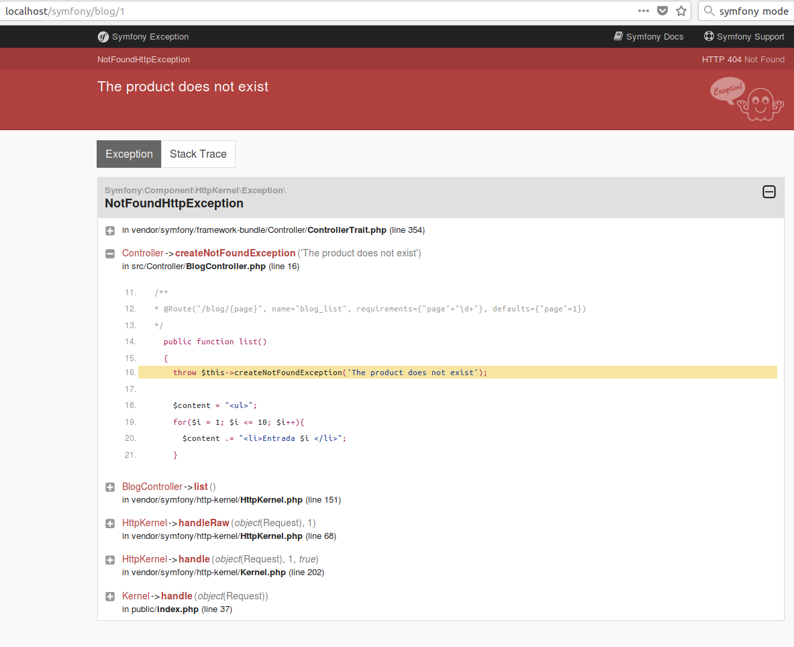
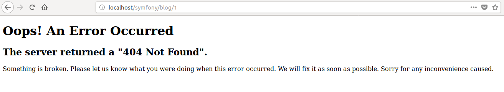

# Controller

Un controlador es una función `PHP` creada por nosotros que lee información del objeto `Request` y crea y devuelve un objeto `Response`. La respuesta podría ser una página `HTML`, `JSON`, `XML`, una descarga de archivos, una redirección, un error 404 o cualquier otra cosa que puedas hacer. El controlador ejecuta cualquier lógica arbitraria que tu aplicación necesita para representar el contenido de una página.

En apartados anteriores hemos visto el uso básico de los controladores y cómo definir las rutas.

## Redireccionar

Si queremos redirigir al usuario a otra página, usamos los métodos `redirectToRoute()` y `redirect()`:

```php
use Symfony\Component\HttpFoundation\RedirectResponse;

// ...
public function indexAction()
{
    // redirect to the "homepage" route
    return $this->redirectToRoute('homepage');

    // redirectToRoute is a shortcut for:
    // return new RedirectResponse($this->generateUrl('homepage'));

    // do a permanent - 301 redirect
    return $this->redirectToRoute('homepage', array(), 301);

    // redirect to a route with parameters
    return $this->redirectToRoute('app_lucky_number', array('max' => 10));

    // redirect externally
    return $this->redirect('http://symfony.com/doc');
}
```
## Gestionar errores y páginas 404
Cuando las cosas no se encuentran, debemos devolver una respuesta `404`. Para hacer esto, lanzamos un tipo especial de excepción:

```php
use Symfony\Component\HttpKernel\Exception\NotFoundHttpException;
// ...
public function indexAction()
{
    // retrieve the object from database
    $product = ...;
    if (!$product) {
        throw $this->createNotFoundException('The product does not exist');

        // the above is just a shortcut for:
        // throw new NotFoundHttpException('The product does not exist');
    }

    return $this->render(...);
}
```
Por supuesto, podemos lanzar cualquier clase de excepción en su controlador: `Symfony` devolverá automáticamente un código de respuesta `HTTP` de `500`.
```php
throw new \Exception('Something went wrong!');
```

Por ejemplo:
```php
//BlogController.php
class BlogController  extends Controller{
    // ...
    /**
  * @Route("/blog/{page}", name="blog_list", requirements={"page"="\d+"}, defaults={"page"=1})
  */
    public function list()
    {
      throw $this->createNotFoundException('Esta entrada no existe');
    }
```
De esta forma, al visitar la página [http://localhost/symfony/blog/1](http://localhost/symfony/blog/1) nos genera la siguiente salida `HTML`, cuando estamos en modo developer, (`dev`)

Y la siguiente salida cuando estamos en modo production (`prod`):

Para cambiar el modo de entorno (_environment_) de `symfony`, se debe editar el fichero `.env`

```php
APP_ENV=prod // prod || dev
```
Se puede cambiar la plantilla devuelta por defecto por `Symfony` cuando se producen errores. En la siguiente [página](https://symfony.com/doc/current/controller/error_pages.html) se explica cómo hacerlo.
## El objeto `Request` 
Podemos usar el objeto `Request` de `Symfony` si lo pasamos como argumento a una función

```php
use Symfony\Component\HttpFoundation\Request;

public function indexAction(Request $request)
{
    $request->isXmlHttpRequest(); // is it an Ajax request?

    $request->getPreferredLanguage(array('en', 'fr'));

    // retrieve GET and POST variables respectively
    $request->query->get('page');
    $request->request->get('page');

    // retrieve SERVER variables
    $request->server->get('HTTP_HOST');

    // retrieves an instance of UploadedFile identified by foo
    $request->files->get('foo');

    // retrieve a COOKIE value
    $request->cookies->get('PHPSESSID');

    // retrieve an HTTP request header, with normalized, lowercase keys
    $request->headers->get('host');
    $request->headers->get('content_type');
}
```
## Devolver una respuesta JSON
Para devolver `JSON` desde un controlador, usamos el método `helper` `json()`. Esto devuelve un objeto especial `JsonResponse` que codifica los datos automáticamente:
```php
// ...
public function indexAction()
{
    // returns '{"username":"jane.doe"}' and sets the proper Content-Type header
    return $this->json(array('username' => 'jane.doe'));

    // the shortcut defines three optional arguments
    // return $this->json($data, $status = 200, $headers = array(), $context = array());
}
```

## Devolver ficheros en streaming
Podemos usar el helper `file()` para servir un archivo desde dentro de un controlador:
```php
use Symfony\Component\HttpFoundation\File\File;
// ...
public function fileAction()
{
    // send the file contents and force the browser to download it
    return $this->file('../static/hola.txt');
}
```
El fichero está en este caso en la carpeta `static` (creada a la altura de public)

El helper `file()` proporciona algunos argumentos para configurar su comportamiento:
```php
use Symfony\Component\HttpFoundation\File\File;
use Symfony\Component\HttpFoundation\ResponseHeaderBag;

public function fileAction()
{
    // load the file from the filesystem
    $file = new File('/path/to/some_file.pdf');

    return $this->file($file);

    // rename the downloaded file
    return $this->file($file, 'custom_name.pdf');

    // display the file contents in the browser instead of downloading it
    return $this->file('invoice_3241.pdf', 'my_invoice.pdf', ResponseHeaderBag::DISPOSITION_INLINE);
}
```

## Uso de sesiones
Podemos usar el objeto `SessionInterface` de `Symfony` si lo pasamos como argumento a una función
```php
use Symfony\Component\HttpFoundation\Session\SessionInterface;

public function indexAction(SessionInterface $session)
{
    // store an attribute for reuse during a later user request
    $session->set('foo', 'bar');

    // get the attribute set by another controller in another request
    $foobar = $session->get('foobar');

    // use a default value if the attribute doesn't exist
    $filters = $session->get('filters', array());
}
```

## Mensajes Flash

También podemos almacenar mensajes especiales, llamados mensajes "flash", en la sesión del usuario. Por diseño, los mensajes flash deben usarse exactamente una vez: desaparecen de la sesión automáticamente tan pronto como los recuperamos. Esta función hace que los mensajes "flash" sean especialmente útiles para almacenar notificaciones de usuario.

Por ejemplo, imagina que está procesando un envío de formulario:
```php
use Symfony\Component\HttpFoundation\Request;

public function updateAction(Request $request)
{
    // ...

    if ($form->isSubmitted() && $form->isValid()) {
        // do some sort of processing

        $this->addFlash(
            'notice',
            'Your changes were saved!'
        );
        // $this->addFlash() is equivalent to $request->getSession()->getFlashBag()->add()

        return $this->redirectToRoute(...);
    }

    return $this->render(...);
}

```
Después de procesar la `request`, el controlador establece un mensaje `flash` en la sesión y luego redirige. La clave del mensaje (aviso en este ejemplo) puede ser cualquier cosa: usará esta clave para recuperar el mensaje.

En la plantilla siguiente (o incluso mejor, en la plantilla de diseño base), leemos los mensajes `flash` de la sesión usando `app.flashes()`:
```php
# templates/base.html.twig #}

{# you can read and display just one flash message type... #}

    <div class="flash-notice">
        {{ message }}
    </div>


{# ...or you can read and display every flash message available #}

    
        <div class="flash-{{ label }}">
            {{ message }}
        </div>
    

```
O en `PHP`
```php
<!-- templates/base.html.php -->

// you can read and display just one flash message type...
<?php foreach ($view['session']->getFlashBag()->get('notice') as $message): ?>
    <div class="flash-notice">
        <?php echo $message ?>
    </div>
<?php endforeach ?>

// ...or you can read and display every flash message available
<?php foreach ($view['session']->getFlashBag()->all() as $type => $flash_messages): ?>
    <?php foreach ($flash_messages as $flash_message): ?>
        <div class="flash-<?php echo $type ?>">
            <?php echo $message ?>
        </div>
    <?php endforeach ?>
<?php endforeach ?>
```
